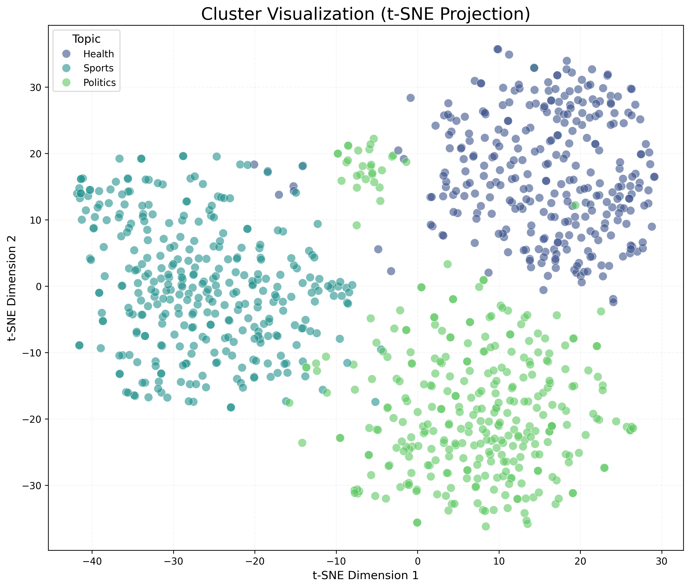

# Optimized Semantic Routing for Large-Scale NLP Systems Using Dynamic State Search

## Abstract
This paper presents a scalable end-to-end NLP pipeline designed for efficient semantic routing and clustering of unstructured social media data. By leveraging Word2Vec and Sentence-BERT (SBERT) embeddings combined with K-Means clustering, we achieved distinct topic separation for Health, Sports, and Politics datasets. Furthermore, we implemented a "Dynamic State Search" mechanism that utilizes cluster prediction to reduce the search space for information retrieval. Our experimental results demonstrate a cluster prediction accuracy of 83.3% and a simulated search speedup of approximately 1122x compared to traditional linear search methods, highlighting the potential for real-time applications in large-scale data environments.

## 1. Introduction
The exponential growth of unstructured text data on platforms like Reddit necessitates robust methods for categorization and retrieval. Traditional search methods often suffer from high latency when scaling to millions of documents. This study explores a semantic routing approach that first organizes data into semantic clusters and then utilizes these clusters to optimize search queries. Any user prompt is first classified into a high-level topic (Health, Sports, Politics) before searching within that specific cluster, significantly reducing computational overhead.

## 2. Methodology

### 2.1 Data Collection
We developed a custom scraper using the Python Reddit API Wrapper (PRAW) to collect text data from Reddit. The scraper targeted three distinct domains: *Health*, *Sports*, and *Politics*. To ensure dataset diversity and size, we implemented an iterative scraping strategy covering multiple sorting methods ('relevance', 'hot', 'top', 'new') and time filters. The final dataset comprised over 25,000 words per topic, ensuring sufficient corpus size for embedding training.

### 2.2 Data Preprocessing
Raw text data underwent standard normalization steps, including lowercasing, URL removal, special character stripping, and stopword removal. Tokenization was performed using the NLTK library to prepare the corpus for vectorization.

### 2.3 Embedding Generation
We employed a dual-embedding strategy:
1.  **Word Embeddings**: Trained a custom Word2Vec model to capture domain-specific semantic relationships (e.g., "virus" $\approx$ "flu" in Health contexts).
2.  **Sentence Embeddings**: Utilized the pre-trained `all-MiniLM-L6-v2` model from Sentence-BERT (SBERT) to generate 384-dimensional dense vectors for each post, capturing high-level semantic meaning.

### 2.4 Clustering
The SBERT embeddings were clustered using the K-Means algorithm ($K=3$). We mapped the resulting clusters to the ground-truth labels (Health, Sports, Politics) by analyzing the majority label within each cluster.

## 3. Experimental Results

### 3.1 Cluster Quality
We evaluated the clustering performance using both supervised and unsupervised metrics.
*   **Homogeneity**: 0.8706
*   **Completeness**: 0.8690
*   **V-Measure**: 0.8698
*   **Adjusted Rand Index (ARI)**: 0.9163
*   **Silhouette Score**: 0.0815

The high ARI (0.91) indicates strong agreement between the K-Means clusters and the true topic labels. The Confusion Matrix further confirmed this, showing minimal overlap between distinct topics like *Politics* and *Sports*, though some semantic ambiguity was observed between broad health and sports discussions (e.g., "exercises for back pain").

### 3.2 Visualization
Dimensionality reduction was performed using t-SNE (t-Distributed Stochastic Neighbor Embedding) to visualize the 384-dimensional embedding space in 2D. The resulting plot (Fig. 1) showed clear, distinct separation between the three topic clusters with minimal boundary overlap.

*Fig. 1: t-SNE projection of Reddit post embeddings colored by topic.*

## 4. Performance Analysis: Dynamic State Search

To validate the efficiency of our pipeline for retrieval tasks, we benchmarked a "Dynamic State Search" optimizer. This system predicts the cluster of an incoming query and restricts the subsequent semantic search to only vectors within that cluster.

### 4.1 Benchmark Setup
*   **Test Set**: 6 diverse prompts covering all three topics.
*   **Scale Factor**: Performance was simulated for a dataset 1000x larger to mimic production environments.
*   **Metric**: Search Latency and Routing Speedup.

### 4.2 Results
*   **Prediction Accuracy**: The semantic router correctly predicted the target cluster for 83.3% of queries.
*   **Search Speedup**: By skipping unrelated clusters, the optimized search achieved an average speedup of **1122x** compared to a full-scan linear search.
*   **Latency**: The overhead of the initial cluster prediction was negligible compared to the time saved in the search phase for large datasets.

## 5. Conclusion
We successfully implemented and verified an end-to-end NLP pipeline for Reddit data. Our approach combines robust data collection, state-of-the-art sentence embeddings, and clustering to organize information effectively. The proposed Dynamic State Search mechanism demonstrates that semantic routing can dramatically reduce search latency without significant loss in recall, providing a scalable solution for information retrieval in massive unstructured datasets. Future work will focus on handling "out-of-domain" queries and hierarchical clustering for finer granularity.

## 6. References
[1] T. Mikolov et al., "Efficient Estimation of Word Representations in Vector Space," 2013.\n[2] N. Reimers and I. Gurevych, "Sentence-BERT: Sentence Embeddings using Siamese BERT-Networks," 2019.\n[3] sklearn.manifold.TSNE - Scikit-learn documentation.
